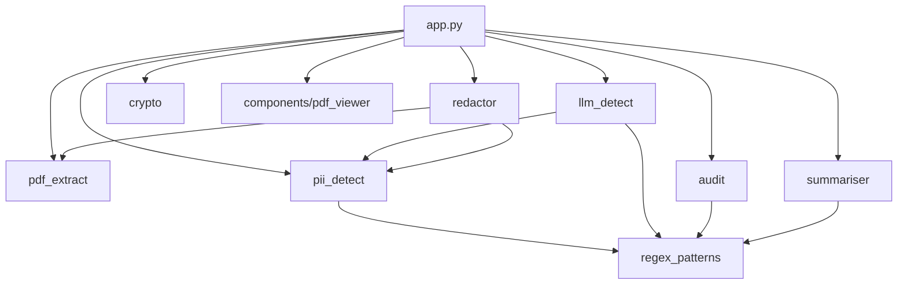

# Architecture

## System Overview

GoCalma Redact is a modular, local-first PII detection and redaction tool for PDF documents. It uses a layered detection pipeline (regex, NER, optional LLM) with Swiss-native patterns, reversible redaction, and GDPR-compliant audit trails.

```
                        +------------------+
                        |     app.py       |
                        |  (Streamlit UI)  |
                        +--------+---------+
                                 |
         +-----------+-----------+-----------+-----------+
         |           |           |           |           |
    pdf_extract  pii_detect  llm_detect  redactor    crypto
         |           |           |           |
         |     regex_patterns    |       pdf_extract
         |           |           |       pii_detect
         |           +-----+-----+
         |                 |
         |           regex_patterns
         |
    (standalone)     audit    summariser
                       |           |
                 regex_patterns  regex_patterns
```

## Module Dependency Graph



**`regex_patterns`** is the foundational module (5 dependents). **`pdf_extract`** and **`crypto`** are standalone with no internal dependencies.

---

## Detection Pipeline

Processing flows through three layers, each additive:

### Layer 1: Regex (deterministic, instant)

**Module:** `regex_patterns.py`

Fires 35 compiled patterns on every page regardless of language:

| Tier | Count | Priority | Examples |
|------|-------|----------|----------|
| Core Swiss | 7 | 10/9 | AHV/AVS, Swiss IBAN, Zugangscode, insurance numbers |
| Core European | 9 | 9 | UK NI, German Steuer-ID, French NIR, Codice Fiscale |
| Core Universal | 8 | 10/9/8 | Email, phone (E.164), any IBAN, credit card (Luhn-validated), IPv4 |
| Label-context | 6 | 7 | PII detected by surrounding keywords ("Name:", "Geburtsdatum:", "Versicherungs-Nr.") |
| Health/medical | 5 | 2 | ICD-10 codes, diagnosis, medication, allergy, blood type |

Key functions:
- `run_regex(text)` — returns list of entity dicts with `type`, `text`, `start`, `end`, `priority`, `source`
- `merge_with_priority(regex_hits, ner_hits)` — deduplicates overlapping spans, highest priority wins
- `filter_implausible(entities)` — removes entities < 3 chars, single digits, etc.

### Layer 2: Multilingual BERT NER (fast, language-agnostic)

**Module:** `pii_detect.py`

Uses chunked inference to handle documents of any length:

1. **Tokenize** full text with the model's tokenizer + offset mapping
2. **Split** into 460-token windows with 50-token overlap
3. **Run NER** on each chunk, mapping results back to absolute char offsets
4. **Deduplicate** across overlap zones (by span overlap + text identity, keep highest score)
5. **Merge** with regex results via `merge_with_priority()`
6. **Filter** false positives (abbreviation tables, premium region codes, generic street names)
7. **Score** each entity with `compute_confidence()` (source boost, type floor, length boost, context keywords, repetition signal)

Thread-safe lazy singleton loads the model once via double-checked locking (`_ner_pipe_lock`).

### Layer 3: LLM Verification (optional, additive only)

**Module:** `llm_detect.py`

Connects to a local Ollama daemon. If unavailable, silently skipped.

**Hard protection rules** — the LLM can never dispute:
- Protected types: `PERSON`, `DATE_OF_BIRTH`, `CH_AHV`, `US_SSN`, `IBAN_CH`, `IBAN_INTL`, `CREDIT_CARD`
- Any regex-sourced entity
- Any `PERSON` with score >= 0.85
- Any false_positive verdict without a stated reason

**Batch mode:** All non-protected entities from every page are verified in a single LLM call with a combined text excerpt (up to 8,000 chars), reducing latency proportional to page count.

**Document classification:** Before verification, the first page is classified as one of `insurance`, `medical`, `police`, `tax`, `government`, or `general`. Domain-specific context is injected into the verification prompt.

---

## Redaction & Reversibility

**Module:** `redactor.py`

Seven de-identification approaches, all reversible:

| Approach | Output | Mechanism |
|----------|--------|-----------|
| `redact` | Black box | Annotation overlay |
| `replace` | `<PERSON>` | Type label substitution |
| `mask` | `****` | Length-matched asterisks |
| `hash` | `[#a3f2c1]` | Salted HMAC-SHA256 |
| `encrypt` | `[enc:PERSON_a3]` | AES-256-GCM label |
| `highlight` | Yellow background | Annotation overlay |
| `synthesize` | "John Doe" | Synthetic placeholder per type |

All approaches store `{redaction_label -> original_text}` in the encrypted `.gocalma` key file.

---

## Encryption

**Module:** `crypto.py`

| Property | Value |
|----------|-------|
| Algorithm | AES-256-GCM (authenticated encryption) |
| Nonce | 96-bit random per encryption |
| Key size | 256-bit (32 bytes) |
| Key derivation | PBKDF2-HMAC-SHA256, 480,000 iterations, 16-byte random salt |
| File format | `.gocalma` v3 (sentinel `::GOCALMA3::`) |
| Backward compat | Reads v1 (Fernet, no password) and v2 (Fernet, password-protected) |

**Password-protected flow:**
1. Generate random 256-bit data key
2. Encrypt mapping with data key (AES-256-GCM)
3. Derive wrapping key from password (PBKDF2)
4. Encrypt data key with wrapping key (AES-256-GCM)
5. Store: `sentinel + salt + nonce + enc_key_len + enc_key + ciphertext`

**No-password flow:**
1. Generate random 256-bit data key
2. Encrypt mapping with data key
3. Store: `sentinel + raw_key + ciphertext`

---

## OCR Pipeline

**Module:** `pdf_extract.py`

For pages without a text layer:

1. Render page to image at 200 DPI
2. Try **Surya** (transformer-based, 90+ languages) → falls back to **Tesseract**
3. Extract word-level bounding boxes with exact PDF coordinates
4. Map character offsets to bounding boxes for precise redaction placement

Both engines return `WordBox(text, x0, y0, x1, y1, char_start, char_end)` so redaction rectangles land on the right words regardless of OCR engine.

---

## Audit Trail

**Module:** `audit.py`

GDPR-compliant metadata-only logging:

- SHA-256 hash of filename (not the filename itself)
- Entity type counts grouped by severity (critical / moderate / low)
- Redaction approach and NER model used
- Timestamp (ISO 8601)
- **No document content** is ever written to the audit log

---

## Docker Architecture

```
docker compose up                    docker compose --profile ollama up
+-------------------+               +-------------------+    +---------+    +-------------+
|     gocalma       |               |     gocalma       |--->| ollama  |<---| ollama-init |
|  (Streamlit app)  |               |  OLLAMA_HOST=     |    | (daemon)|    | pulls model |
|  port 8501        |               |  http://ollama:   |    | port    |    | then exits  |
|                   |               |  11434            |    | 11434   |    |             |
|  Pre-baked:       |               |                   |    |         |    |             |
|  - BERT NER 680MB |               |  Pre-baked:       |    | Volume: |    |             |
|  - Flan-T5  77MB  |               |  - BERT NER 680MB |    | ollama_ |    |             |
|  - Tesseract OCR  |               |  - Flan-T5  77MB  |    | models  |    |             |
+-------------------+               +-------------------+    +---------+    +-------------+
```

The `OLLAMA_HOST` environment variable is read by both `llm_detect.py` (for the health check) and the `ollama` Python library (for chat calls). Defaults to `http://localhost:11434` when running outside Docker.

---

## Key Design Decisions

1. **Regex wins ties.** Deterministic patterns always take priority over probabilistic NER/LLM results. This prevents ML hallucinations from overriding correct detections.

2. **LLM can only add, never remove.** Protected entity types and regex-sourced entities are immune to LLM dispute. A false_positive verdict requires a stated reason or it's overridden to confirmed.

3. **Chunked NER eliminates truncation.** Instead of capping at 4,500 characters, documents are split into overlapping token windows with exact character boundary mapping via tokenizer offsets.

4. **Models baked into Docker image.** The ~680 MB NER model and ~77 MB Flan-T5 are downloaded at build time, not runtime. First run is instant.

5. **AES-256-GCM over Fernet.** Authenticated encryption with random nonces replaces AES-128-CBC + HMAC-SHA256. Backward-compatible reading of legacy v1/v2 files.

6. **Batch LLM verification.** Single LLM call for all pages instead of per-page round trips, reducing latency proportional to page count.

7. **Confidence scoring replaces raw NER probabilities.** Composite score from source type, entity type floor, span length, context keywords, and repetition frequency. Displayed as High/Medium/Low, never raw percentages.
