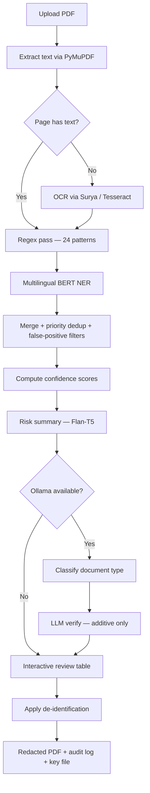
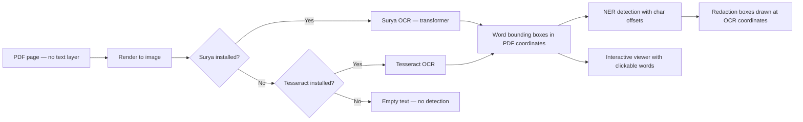
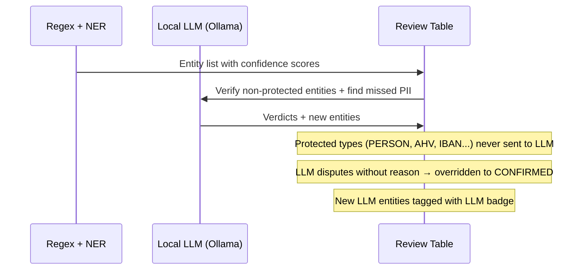
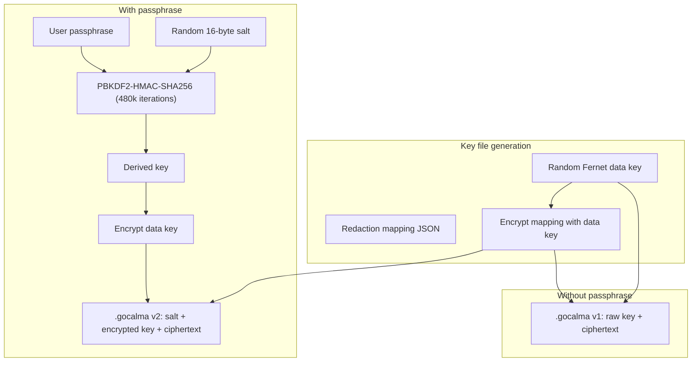

# GoCalma Redact 🔒

[](PLACEHOLDER)
[](PLACEHOLDER)
[]()
[]()
[](LICENSE)

**Privacy-first PDF redaction with native Swiss document support, multilingual AI detection, and zero third-party data sharing.**

The only redaction tool that covers AHV numbers, Zugangscodes, and Swiss IBANs natively — plus full GDPR audit trails and LLM verification that can never suppress real PII.

---

## Try It (2 Minutes)

1. Open [Live App → PLACEHOLDER]
2. Upload any PDF with personal information
3. See detected PII with risk severity — **Critical** / **Moderate** / **Low**
4. Review entities, toggle off any false positives
5. Choose redaction mode and click **Redact**
6. Download: redacted PDF + audit log (`.json`) + encrypted key (`.gocalma`)
7. Restore: drag all three files back in to un-redact


---

## What Makes This Different

### Multilingual by Default

Detects PII in English, German, French, Italian, Spanish, Portuguese, and Dutch using a single multilingual BERT model (`Davlan/bert-base-multilingual-cased-ner-hrl`). No model selection required. Language is detected automatically per page. Two additional NER models available in the Advanced panel: `dslim/bert-base-NER` (English-only, faster) and `Davlan/xlm-roberta-large-ner-hrl` (highest accuracy, slower).

### Swiss-Native Patterns

Built-in regex recognizers for AHV/AVS numbers (`756.XXXX.XXXX.XX`), Swiss IBANs (`CH56 0483 ...`), Zugangscodes (`ABCD-EFgh-IJKL-MNop`), CH postal codes, Swiss personal IDs, reference numbers, and insurance policy numbers — patterns that no other open-source redaction tool covers out of the box. All 24 regex patterns fire on every document regardless of language.

### LLM That Only Adds, Never Removes

An optional local LLM (any Ollama model — defaults to `qwen2.5:0.5b`) acts as a second pass to catch missed PII. Critically: it can never dispute a high-confidence detection. Person names, AHV numbers, IBANs, SSNs, credit cards, and dates of birth are protected types — the LLM cannot mark them as false positives under any circumstance. Regex-sourced entities are completely immune to LLM dispute. If Ollama isn't running, the LLM step is silently skipped.

---

## Detection Pipeline

### Layer 1 — Regex (instant, deterministic)

Always runs. Covers 24 compiled patterns across three tiers:

| Tier | Entity Types |
|------|-------------|
| 🇨🇭 **Swiss** | AHV/AVS (dot and space formats), IBAN CH, Zugangscode, CH postal code, CH personal ID, CH reference ID (10–13 digits), insurance number (3-3-3 format) |
| 🇪🇺 **European** | US SSN, UK National Insurance, UK postcode, German Steuer-ID, French NIR, Italian Codice Fiscale, Spanish DNI, Spanish NIE, ICAO passport number |
| 🌍 **Universal** | Email, international phone (E.164), any-country IBAN, credit card (13–19 digits), IPv4 address, date of birth (DD.MM.YYYY and YYYY-MM-DD) |

Priority: 10 (highest confidence, wins all merge conflicts). Source code: [`regex_patterns.py`](gocalma/regex_patterns.py).

### Layer 2 — Multilingual BERT NER (fast, language-agnostic)

| Setting | Value |
|---------|-------|
| Default model | `Davlan/bert-base-multilingual-cased-ner-hrl` |
| Languages | EN, DE, FR, IT, ES, PT, NL |
| Detects | PERSON, LOCATION, ORGANIZATION, DATE_TIME |
| Priority | 6 (names), 5 (locations), 4 (organisations), 3 (dates) |
| Max input | 4,500 characters (BERT 512-token limit) |

Two alternative models selectable in Advanced: `dslim/bert-base-NER` (English-only) and `Davlan/xlm-roberta-large-ner-hrl` (XLM-RoBERTa Large). The pipeline lazily reloads when you switch. Source code: [`pii_detect.py`](gocalma/pii_detect.py).

### Layer 3 — LLM Verification (optional, additive only)

| Setting | Value |
|---------|-------|
| Backend | Ollama (local) |
| Default model | `qwen2.5:0.5b` (~400 MB) |
| Role | Find PII that regex and NER missed |
| Cannot dispute | PERSON, DATE_OF_BIRTH, CH_AHV, US_SSN, IBAN_CH, IBAN_INTL, CREDIT_CARD, or any regex-sourced entity |
| If unavailable | Skipped silently — NER results returned unchanged |

The LLM selector in the Advanced panel shows every model you have pulled in Ollama. The verification prompt defaults to CONFIRMED and requires a reason for any FALSE_POSITIVE verdict. Source code: [`llm_detect.py`](gocalma/llm_detect.py).

### Merge & Filter

**Priority merge:** When two detection passes flag the same span, highest priority wins. AHV (10) beats phone (8) beats NER name (6). Two-pass deduplication: first by span overlap, then by text identity (case-insensitive).

**False-positive filters** (applied automatically):

| Filter | What it catches |
|--------|----------------|
| Minimum length | Entities under 3 characters discarded |
| Context-aware location | "Switzerland" after "anywhere in" = product description, not an address |
| Abbreviation tables | GIC, AIC, UVG-style codes near legend keywords |
| Premium region codes | "BE 3", "ZH 1" near "premium region" |
| Generic street names | "Bahnhofstrasse" alone → not a personal address (no house number) |

**Confidence scoring** (replaces raw NER token probability):

| Signal | Effect |
|--------|--------|
| Regex source | Always 1.0 (deterministic) |
| Type floor | PERSON min 0.80, EMAIL min 0.95, PHONE min 0.80 |
| Span length | 2 words +0.10, 3+ words +0.15 |
| Context keywords | Near "policyholder", "Herr", "insurance no." → +0.10 |
| Repetition | Same text 3+ times in document → +0.10 |

Displayed as: **High** (green, ≥0.90) / **Medium** (amber, ≥0.70) / **Low** (gray, <0.70). Raw percentages are never shown. Source code: [`pii_detect.py:compute_confidence()`](gocalma/pii_detect.py).

---

## Supported Entity Types

| Entity | Example | Source | Priority | Coverage |
|--------|---------|--------|----------|----------|
| CH_AHV | `756.1234.5678.90` | Regex | 10 | 🇨🇭 |
| IBAN_CH | `CH56 0483 5012 3456 7800 9` | Regex | 10 | 🇨🇭 |
| IBAN_INTL | `DE89 3704 0044 0532 0130 00` | Regex | 10 | 🌍 |
| US_SSN | `123-45-6789` | Regex | 10 | 🌍 |
| CREDIT_CARD | `4111-1111-1111-1111` | Regex | 10 | 🌍 |
| CH_ZUGANGSCODE | `ABCD-EFgh-IJKL-MNop` | Regex | 9 | 🇨🇭 |
| CH_ID_NUMBER | `12-3456-78` | Regex | 9 | 🇨🇭 |
| CH_REFERENCE_ID | `100000000000` | Regex | 9 | 🇨🇭 |
| INSURANCE_NUMBER | `100 452 956` | Regex | 9 | 🇨🇭 |
| EMAIL | `info@example.ch` | Regex | 9 | 🌍 |
| UK_NI | `AB123456C` | Regex | 9 | 🇪🇺 |
| DE_STEUER_ID | `12345678901` | Regex | 9 | 🇪🇺 |
| FR_NIR | `185081234567890` | Regex | 9 | 🇪🇺 |
| IT_CODICE_FISCALE | `RSSMRA85M01H501Z` | Regex | 9 | 🇪🇺 |
| ES_DNI | `12345678Z` | Regex | 9 | 🇪🇺 |
| ES_NIE | `X1234567L` | Regex | 9 | 🇪🇺 |
| ICAO_PASSPORT | `AB123456789` | Regex | 9 | 🌍 |
| PHONE_INTL | `+41 79 123 45 67` | Regex | 8 | 🌍 |
| IP_ADDRESS | `192.168.1.1` | Regex | 8 | 🌍 |
| PERSON | `Max Mustermann` | NER | 6 | 🌍 |
| UK_POSTCODE | `SW1A 1AA` | Regex | 5 | 🇪🇺 |
| CH_POSTAL | `8003 Zürich` | Regex | 5 | 🇨🇭 |
| LOCATION | `Zürich` | NER | 5 | 🌍 |
| ORGANIZATION | `Helsana AG` | NER | 4 | 🌍 |
| DATE_OF_BIRTH | `26.03.1975` | Regex | 3 | 🌍 |
| DATE_TIME | `26. März 1975` | NER | 3 | 🌍 |

Swiss-specific patterns fire on every document regardless of language.


---

## De-identification Modes

| Approach | Visual result | Reversible | Notes |
|----------|--------------|------------|-------|
| **redact** | ████████ (black box) | Yes | Original text recoverable via key file |
| **replace** | `<PERSON>` | Yes | Default mode |
| **mask** | `****` | Yes | Length matches original |
| **hash** | `[#a3f2c1...]` | Yes | Salted HMAC-SHA256, key stored in `.gocalma` |
| **encrypt** | `[enc:PERSON_a3]` | Yes | Fernet-encrypted label |
| **highlight** | Yellow highlight | Yes | Text stays visible |
| **synthesize** | "John Doe", "redacted@example.com" | Yes | Synthetic placeholder per entity type |

All approaches store the original text in the encrypted `.gocalma` key file. Source code: [`redactor.py`](gocalma/redactor.py).


---

## De-redaction (Reverse Redaction)

Upload the redacted PDF together with its `.gocalma` key file. The mode is auto-detected:

| Mode | What happens |
|------|-------------|
| **Reversible** | Annotations removed, original PDF restored for download |
| **Permanent** | Text layer was destroyed — redaction mapping (JSON) shown for reference |


---

## Privacy Architecture

### 100% Local (default)

Everything runs on your machine. Nothing leaves it.

```bash
streamlit run app.py
# → http://localhost:8501
```

All AI models run locally:
- **Multilingual BERT NER:** ~700 MB (downloads once on first use, cached in `~/.cache/huggingface`)
- **Flan-T5 risk summariser:** 77 MB (downloads once)
- **Qwen2.5 LLM** (optional): pulled via Ollama

No external API calls. No telemetry. No network requests during processing.

---

## GDPR & Compliance

| Feature | Detail |
|---------|--------|
| **Data residency** | 100% local — no data leaves your machine |
| **Retention** | Zero — documents processed in memory only |
| **Third-party APIs** | None — all inference is local (BERT, Flan-T5, Ollama) |
| **Audit trail** | Timestamped JSON per redaction — entity types and counts only, no document content |
| **Encryption** | AES-128-CBC + HMAC-SHA256 (Fernet) with PBKDF2 key derivation |
| **Key derivation** | PBKDF2-HMAC-SHA256, 480,000 iterations (OWASP 2024 recommendation) |
| **Upload cap** | 50 MB |
| **Prompt injection guard** | Document content wrapped in `<document_content>` delimiters, model output validated |
| **LLM failure mode** | Graceful — returns NER entities unchanged on any error |

The audit log ([`audit.py`](gocalma/audit.py)) records: timestamp, SHA-256 filename hash, entity type counts with severity classification, redaction mode, and model used. No document content is ever stored.

---

## Architecture



### OCR Pipeline

For image-only or scanned PDFs, GoCalma automatically runs OCR:



Word bounding boxes from OCR are stored with exact character offsets, ensuring redaction rectangles land precisely on the right words even for photographed documents.

### LLM Verification Pipeline



---

## Security Model



**Security details:**
- Encryption: Fernet (AES-128-CBC + HMAC-SHA256) via Python `cryptography` library
- Key derivation: PBKDF2-HMAC-SHA256 with random 16-byte salt, 480,000 iterations
- File format: `.gocalma` v1 (no password) or v2 (password-protected)
- Upload size capped at 50 MB
- LLM prompt-injection guard: `<document_content>` delimiters
- LLM hallucination filter: entities whose text doesn't appear in the source are discarded
- Graceful LLM failure: inference errors return NER entities unchanged
- Source code: [`crypto.py`](gocalma/crypto.py)

---

## Quick Start

### Option A — Local (Python 3.9+)

```bash
git clone https://github.com/alallaqi/go-calma-redact
cd go-calma-redact
python -m venv .venv
source .venv/bin/activate
pip install -r requirements.txt
streamlit run app.py
# → http://localhost:8501
```

> **First run:** The multilingual BERT NER model (~700 MB) and Flan-T5 summariser (~77 MB) download automatically on first use and are cached locally. Subsequent runs are instant.

### Option B — With LLM verification

```bash
# Install Ollama
brew install ollama    # macOS
# or: curl -fsSL https://ollama.ai/install.sh | sh  # Linux

# Start Ollama and pull a model
ollama serve
ollama pull qwen2.5:0.5b    # 400 MB, fastest
# or: ollama pull qwen2.5:1.5b   # 1.5 GB, more accurate

# Run the app — it auto-detects Ollama
streamlit run app.py
```

### OCR for scanned PDFs (pick one)

**Option A — Surya (recommended, pure pip)**
```bash
pip install "surya-ocr<0.5"
```

**Option B — Tesseract (fallback)**
```bash
# macOS
brew install tesseract tesseract-lang

# Ubuntu / Debian
sudo apt-get install tesseract-ocr tesseract-ocr-deu tesseract-ocr-fra tesseract-ocr-ita
```

---

## Advanced Model Selection

The Advanced panel in the sidebar exposes both NER and LLM model selectors.

### NER Models

| Model | Languages | Best for |
|-------|-----------|----------|
| `Davlan/bert-base-multilingual-cased-ner-hrl` | EN DE FR IT ES PT NL | All-round (default) |
| `dslim/bert-base-NER` | EN | English-only documents, faster |
| `Davlan/xlm-roberta-large-ner-hrl` | EN DE FR IT ES PT NL | Maximum accuracy, slower |

Only installed models appear without a warning badge. The pipeline lazily reloads when you switch.


### LLM Models

The LLM dropdown shows every model you have pulled in Ollama. Any Ollama-compatible model works — the verification prompt is model-agnostic.


---

## Project Structure

```
gocalma-redact/
├── app.py                          Streamlit UI — upload, review, redact, de-redact
├── requirements.txt
├── IMPROVEMENTS.md
├── assets/
│   ├── logo.png
│   └── readme-assets/              Screenshots for this README
├── benchmarks/
│   └── run_benchmark.py            Standalone NER model benchmarking tool
├── tests/
│   ├── test_recognizers.py         Regex, merge, confidence, LLM protection, false positives
│   ├── test_llm_detect.py          LLM prompt parsing, doc classification, entity protection
│   ├── test_pii_detect.py          NER pipeline, deduplication, language detection
│   ├── test_pdf_extract.py         PDF extraction, OCR, page limits
│   ├── test_redactor.py            All 7 de-id modes, reversibility, HMAC hash
│   └── test_crypto.py              Fernet encryption, PBKDF2, key file formats
└── gocalma/
    ├── pii_detect.py               Multilingual BERT NER + confidence scoring
    ├── regex_patterns.py           24 compiled patterns + priority merge + filters
    ├── llm_detect.py               Ollama LLM verification — additive only, entity protection
    ├── summariser.py               Flan-T5 risk summary (critical / moderate / low)
    ├── audit.py                    GDPR audit trail — metadata only, no document content
    ├── redactor.py                 7 de-id modes, OCR-aware, reversible annotations
    ├── crypto.py                   Fernet + PBKDF2-480k, .gocalma key file format
    ├── pdf_extract.py              PyMuPDF text extraction + Surya/Tesseract OCR
    └── components/
        ├── pdf_viewer.py           Streamlit component wrapper
        └── frontend/
            └── index.html          Interactive PDF viewer (hover + double-click)
```

**Test suite:** 179 tests across 6 test files. Run with `python -m pytest tests/ -v`.

---

## Roadmap

- [ ] React / Vanilla JS frontend (in progress)
- [ ] Vercel frontend deployment
- [ ] Batch processing (multiple PDFs, ZIP output)
- [ ] SwissBERT option in Advanced mode for maximum Swiss German accuracy
- [ ] Smaller quantised LLM (Qwen2.5-0.5B) for sub-3s verification

---

## License

MIT
