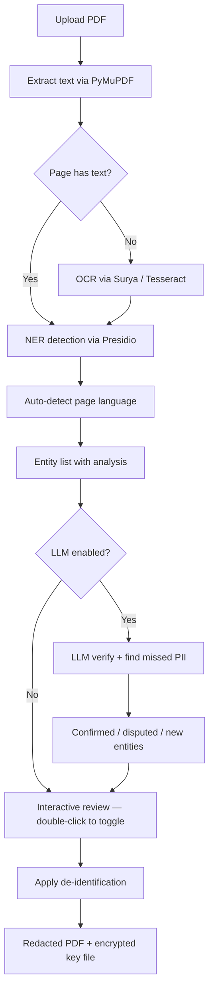
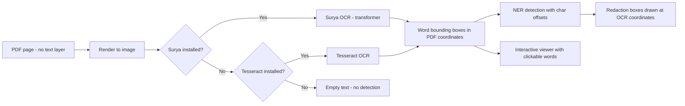
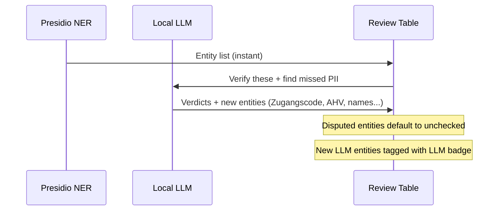
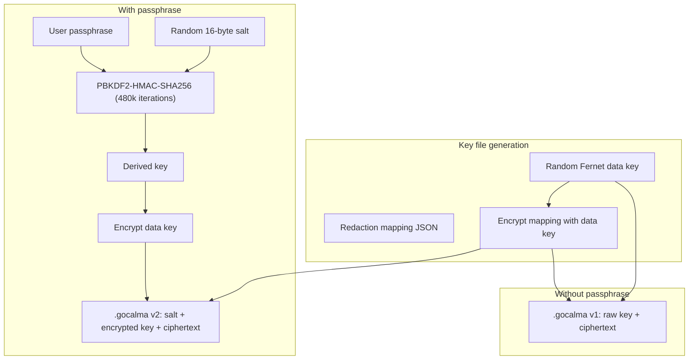

# GoCalma Redact — Local PII Redaction for PDFs

GoCalma Redact lets you upload a PDF, automatically detect personal information (PII), interactively review what was found, and generate a redacted copy — all locally on your machine. No data ever leaves your computer.

## Features

- **100% local processing** — zero external API calls, all inference runs on-device
- **Dual detection pipeline** — Microsoft Presidio NER + optional local LLM verification
- **Swiss & European PII** — AHV/AVS, Zugangscodes, IBAN, DACH addresses, German dates, CH postal codes, Swiss reference IDs
- **9 NER model backends** — spaCy (EN + DE + multilingual), HuggingFace Transformers, SwissBERT-NER, Stanza
- **Multilingual OCR** — Surya (transformer-based, 90+ languages, recommended) or Tesseract fallback
- **Language auto-detection** — each page routed to the correct NER language automatically
- **7 de-identification approaches** — redact, replace, mask, hash, encrypt, highlight, synthesize
- **Interactive PDF viewer** — hover and double-click words directly on the document to add/remove redactions (works on OCR pages too)
- **Live side-by-side preview** — original and redacted views update in real time
- **Reversible redactions** — encrypted `.gocalma` key file with optional PBKDF2 passphrase protection
- **LLM verification** — Phi-3.5-mini, Mistral-7B, Qwen2.5, or Ollama models verify NER findings and catch missed PII

## Architecture



## Quick Start

```bash
# 1. Clone the repo
git clone <repo-url>
cd gocalma-redact

# 2. Create and activate a virtual environment (Python 3.9+)
python -m venv .venv
source .venv/bin/activate      # macOS / Linux
# .venv\Scripts\activate       # Windows

# 3. Install dependencies
pip install -r requirements.txt

# 4. Download the default spaCy English model
python -m spacy download en_core_web_lg

# 5. Run the app
streamlit run app.py
```

The app opens at **http://localhost:8501**.


> **First run:** The Surya OCR models (~1 GB) download automatically on first use and are cached locally. Subsequent runs are instant. If you enable an LLM backend, model weights (3–15 GB depending on the model) also download on first use.

> **Before redacting:** Always review the detected entities in the interactive table. Verify that all sensitive information has been found — especially on scanned documents — before generating the redacted PDF. Double-click any word directly on the document to add missed items manually.

## Full Installation Guide

### Core (required)

```bash
pip install -r requirements.txt
python -m spacy download en_core_web_lg      # English NER (default)
python -m spacy download en_core_web_sm      # Tokeniser for HuggingFace models
```

### OCR for scanned PDFs (pick one)

**Option A — Surya (recommended, pure pip, no system binary)**
```bash
pip install "surya-ocr<0.5"   # pinned for Python 3.9 compatibility
```
Surya auto-detects the document language. No flags needed.

**Option B — Tesseract (fallback)**
```bash
# macOS
brew install tesseract tesseract-lang

# Ubuntu / Debian
sudo apt-get install tesseract-ocr \
  tesseract-ocr-deu tesseract-ocr-fra tesseract-ocr-ita
```

### German / Swiss NER models (recommended for Swiss documents)

```bash
python -m spacy download de_core_news_lg     # German NER
python -m spacy download xx_ent_wiki_sm      # Multilingual DE/FR/IT/EN
```

### LLM verification (optional, improves recall)

**Phi-3.5-mini (~7 GB, fastest local option)**
```bash
huggingface-cli download microsoft/Phi-3.5-mini-instruct \
  --local-dir ~/phi_models/Phi-3.5-mini-instruct
```

**Phi-4-mini (~8 GB)**
```bash
huggingface-cli download microsoft/Phi-4-mini-instruct \
  --local-dir ~/phi_models/Phi-4-mini-instruct
```

**Mistral-7B (~15 GB, most accurate)**
```bash
huggingface-cli download mistralai/Mistral-7B-Instruct-v0.3 \
  --local-dir ~/mistral_models/7B-Instruct-v0.3
```

**Qwen2.5-1.5B (~3 GB, smallest)**
```bash
huggingface-cli download Qwen/Qwen2.5-1.5B-Instruct \
  --local-dir ~/qwen_models/Qwen2.5-1.5B-Instruct
```

**Ollama (easiest, quantized)**
```bash
brew install ollama
ollama serve
ollama pull llama3.2     # or phi3:mini, qwen2.5:1.5b
```

## Supported Entity Types

| Entity | Example | Source |
|---|---|---|
| PERSON | Max Mustermann | NER |
| EMAIL_ADDRESS | info@example.ch | NER |
| PHONE_NUMBER | 044 123 45 67 | NER + Pattern |
| LOCATION | Zürich | NER |
| ADDRESS | Musterstrasse 1 | Custom recognizer |
| DATE_TIME | 26. März 1975 / 31.01.2024 | NER + German pattern |
| CH_AHV | 756.1234.5678.90 | Custom recognizer |
| CH_POSTAL | 8003 (with city) | Custom recognizer |
| CH_ACCESS_CODE | ABCD-EFgh-IJKL-MNop | Custom recognizer |
| CH_ID_NUMBER | 12-3456-78 / 100000000000 | Custom recognizer |
| IBAN_CODE | CH56 0483 5012 3456 7800 9 | NER |
| CREDIT_CARD | 4111-1111-1111-1111 | NER |
| IP_ADDRESS | 192.168.1.1 | NER |
| NRP | Nationalität / citizenship | NER |
| + all Presidio built-in types | | NER |

Swiss-specific recognizers fire for all supported languages (de / fr / it / en).


## NER Model Backends

| Model | Languages | Speed | Best for |
|---|---|---|---|
| `spaCy/en_core_web_lg` | EN | ⚡ Fast | English documents (default) |
| `spaCy/de_core_news_lg` | DE | ⚡ Fast | German / Swiss-German documents |
| `spaCy/xx_ent_wiki_sm` | DE FR IT EN | ⚡ Fast | Mixed-language Swiss documents |
| `HuggingFace/ZurichNLP/swissbert-ner` | DE FR IT RM | 🐢 Medium | Swiss-specific NER, best coverage |
| `HuggingFace/dslim/bert-base-NER` | EN | 🐢 Medium | General multilingual |
| `HuggingFace/StanfordAIMI/stanford-deidentifier-base` | EN | 🐢 Medium | Medical de-identification |
| `HuggingFace/obi/deid_roberta_i2b2` | EN | 🐢 Slow | Medical records |
| `stanza/en` | EN | 🐢 Slow | High-accuracy English |
| `flair/ner-english-large` | EN | 🐢 Slow | Flair NER |

Only installed backends appear in the dropdown. Uninstalled models show "(not installed)".


## De-identification Approaches

| Approach | Visual result | Reversible |
|---|---|---|
| **redact** | ████████ (black box) | Yes |
| **replace** | `<PERSON>` | Yes |
| **mask** | `****` | Yes |
| **hash** | `[#a3f2c1...]` | Yes |
| **encrypt** | `[enc:PERSON_a3]` | Yes |
| **highlight** | Yellow highlight | Yes |
| **synthesize** | "John Doe", "redacted@example.com" | Yes |

All approaches store the original text in the encrypted key file.


## De-redaction (Reverse Redaction)

GoCalma can reverse redactions when the PDF was processed in **reversible mode**. Upload the redacted PDF together with its `.gocalma` key file to restore the original document.

| Mode | What happens |
|---|---|
| **Reversible** | Annotations are removed and the original PDF is restored for download |
| **Permanent** | Original text was destroyed — only the redaction mapping (JSON) is shown for reference |

The mode is auto-detected: if the PDF contains annotation overlays matching the key file labels, it's reversible. If the text layer was flattened/destroyed, it's permanent.


## OCR Pipeline

For image-only or scanned PDFs, GoCalma automatically runs OCR:



Word bounding boxes from OCR are stored with exact character offsets, ensuring redaction rectangles land precisely on the right words even for photographed documents.

## LLM Verification Pipeline

When enabled, the LLM runs **after** NER as a second pass:



The LLM prompt is tuned for Swiss documents: it explicitly lists AHV numbers, Zugangscodes, PIDs, and Swiss reference formats, and defaults to `confirmed` when uncertain to minimize missed PII.


## Security Model



**Security features:**
- Upload size capped at 50 MB
- Key file passphrase: PBKDF2-HMAC-SHA256, 480,000 iterations (OWASP recommendation)
- Thread-safe NLP engine cache with LRU eviction (max 2 models in memory)
- LLM prompt-injection guard: document content wrapped in `<document_content>` delimiters
- LLM hallucination filter: entities whose text doesn't appear in the source are discarded
- Graceful LLM failure: inference errors return original NER entities unchanged
- All file handles use `try/finally` for guaranteed cleanup

## Project Structure

```
gocalma-redact/
├── app.py                          # Streamlit UI entry point
├── requirements.txt
├── README.md
├── .gitignore
├── assets/
│   ├── logo.png
│   └── favicon.png
├── benchmarks/
│   └── run_benchmark.py            # Standalone NER model benchmarking tool
├── tests/
└── gocalma/
    ├── __init__.py
    ├── pdf_extract.py              # PDF text extraction + Surya/Tesseract OCR
    ├── pii_detect.py               # Presidio NER (9 backends, Swiss recognizers, lang detection)
    ├── llm_detect.py               # LLM verification pipeline (Phi/Mistral/Qwen/Ollama)
    ├── redactor.py                 # PDF redaction engine (7 approaches, OCR-aware)
    ├── crypto.py                   # Encrypted key file (Fernet + PBKDF2)
    └── components/
        ├── pdf_viewer.py           # Streamlit component wrapper
        └── frontend/
            └── index.html          # Interactive PDF viewer (hover + double-click)
```

## NER Benchmark

A standalone benchmarking script is included at `benchmarks/run_benchmark.py`. It iterates all available NER models across a folder of PDFs and outputs timing and entity detection statistics.

```bash
# Run against a folder of PDFs
python benchmarks/run_benchmark.py /path/to/pdfs

# Run specific models only
python benchmarks/run_benchmark.py /path/to/pdfs \
  --models "spaCy/en_core_web_lg" "spaCy/de_core_news_lg"

# Output goes to benchmarks/results.json + benchmarks/results.xlsx
```

### Benchmark Results — 14 English/Mixed PDFs (insurance, invoices)

| Model | Avg/Doc | Cold Start | Total Entities | Unique Types | Notes |
|---|---|---|---|---|---|
| **spaCy/en_core_web_lg** | **0.10s** | 1.4s | **1,211** | 14 | Best speed + coverage |
| HuggingFace/dslim/bert-base-NER | 0.28s | 2.9s | 1,005 | 13 | Over-classifies ORGANIZATION |
| HuggingFace/StanfordAIMI/stanford-deidentifier-base | 0.25s | 3.4s | 914 | 10 | Adds `ID` entity type |
| HuggingFace/obi/deid_roberta_i2b2 | 0.78s | **169s** | 690 | 15 | Medical focus, slow cold start |
| stanza/en | 1.04s | 50s | 669 | 14 | Accurate but slow |
| HuggingFace/ZurichNLP/swissbert-ner | 0.05s* | 8.6s | 470* | 7* | *Needs German docs; PERSON/LOC fixed |
| flair/ner-english-large | — | — | — | — | Not compatible with current Presidio |

**Key findings:**
- spaCy is the fastest and catches the most entities on English documents
- SwissBERT is the right choice for German/Swiss documents after the XMod `set_default_language` fix
- obi/deid_roberta_i2b2 has a 169s cold start — unusable in interactive contexts
- For Swiss tax forms and government letters, `de_core_news_lg` + SwissBERT + Swiss pattern recognizers gives the best combined coverage

## Roadmap

- **Faster LLM verification** — evaluate smaller/quantized models (Qwen2.5-0.5B, SmolLM2) to reduce per-page verification time below 3s while maintaining Swiss PII recall
- **ML-based entity ranking** — train a lightweight classifier on Swiss document patterns to score and prioritise detected entities, reducing false positives without an LLM
- **Batch processing** — redact multiple PDFs in one run with a shared output folder

## License

MIT
