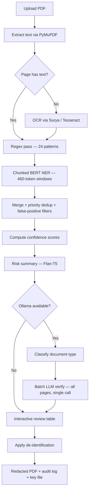
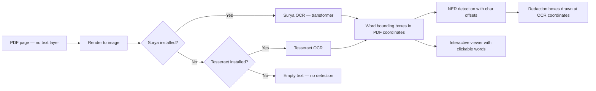
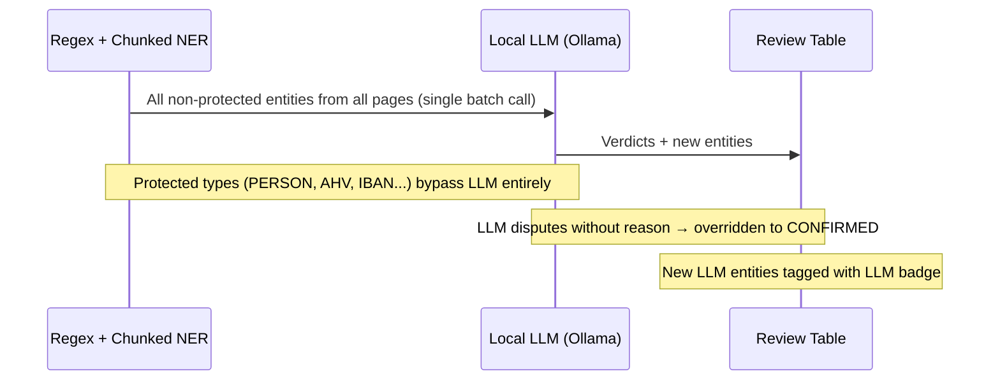
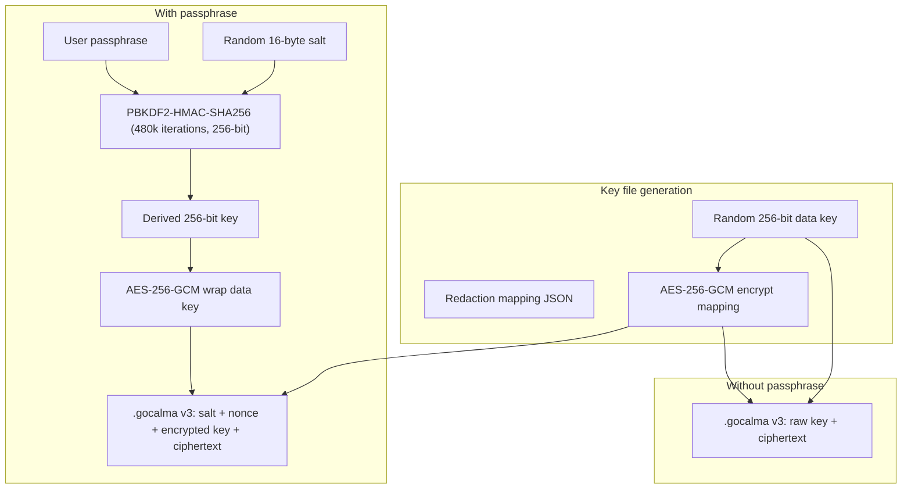

# GoCalma Redact 🔒

[](https://huggingface.co/spaces/al-allaqi/gocalma-redact)
[]()
[]()
[]()
[](LICENSE)

**Privacy-first PDF redaction powered by a dual-pass AI pipeline: regex + multilingual BERT NER detect PII, then a local LLM verifies and catches what they missed — with hard safety rails that prevent the LLM from ever suppressing real PII.**

---

## The Dual-Pass AI Pipeline

Most redaction tools run a single NER model and call it done. GoCalma runs **three detection layers** — and the third one is what makes it different.

```
Document → 35 Regex Patterns → Multilingual BERT NER → Local LLM Verification
              (deterministic)     (7 languages)          (catches what NER missed)
```

**Layer 1 — Regex** fires 35 patterns instantly: Swiss AHV numbers, IBANs, Zugangscodes, insurance policy numbers, credit cards (Luhn-validated), and 6 label-context patterns that detect PII by surrounding keywords like "Versicherungs-Nr." and "Geburtsdatum".

**Layer 2 — Multilingual BERT NER** runs chunked inference (460-token windows, unlimited document length) across 7 languages to find names, locations, organisations, and dates.

**Layer 3 — Local LLM Verification** (any Ollama model) classifies the document type (insurance, medical, police, tax, government), then verifies every NER entity and discovers PII that both regex and NER missed — in a single batch call across all pages. The LLM operates under **hard safety rails**:

- **Protected types** (PERSON, AHV, IBAN, SSN, credit card, DOB) — the LLM can never mark these as false positives
- **Regex entities** — completely immune to LLM dispute (deterministic = always correct)
- **No reason = no rejection** — the LLM must provide a reason to reject anything; without one, the entity stays
- **Graceful degradation** — if Ollama isn't running, NER results are returned unchanged

Everything runs **100% locally**. No API calls, no telemetry, no data leaves your machine.

---

## Try It

**[Live Demo →](https://huggingface.co/spaces/al-allaqi/gocalma-redact)** — deployed on Hugging Face Spaces, runs in your browser with no install needed (NER + regex). For the full pipeline with LLM verification, run locally:

```bash
./start.sh    # one command — Docker handles everything
# → http://localhost:8501
```

1. Upload any PDF with personal information
2. See detected PII with risk severity — **Critical** / **Moderate** / **Low**
3. Review entities, toggle off any false positives
4. Choose redaction mode and click **Redact**
5. Download: redacted PDF + audit log (`.json`) + encrypted key (`.gocalma`)
6. Restore: drag all three files back in to un-redact


---

## What Makes This Different

### Multilingual by Default

Detects PII in English, German, French, Italian, Spanish, Portuguese, and Dutch using a single multilingual BERT model (`Davlan/bert-base-multilingual-cased-ner-hrl`). No model selection required. Language is detected automatically per page. Two additional NER models available in the Advanced panel: `dslim/bert-base-NER` (English-only, faster) and `Davlan/xlm-roberta-large-ner-hrl` (highest accuracy, slower).

### Swiss-Native Patterns

Built-in regex recognizers for AHV/AVS numbers (`756.XXXX.XXXX.XX`), Swiss IBANs (`CH56 0483 ...`), Zugangscodes (`ABCD-EFgh-IJKL-MNop`), CH postal codes, Swiss personal IDs, reference numbers, and insurance policy numbers — patterns that no other open-source redaction tool covers out of the box. Three regex tiers fire on every document: **24 core patterns**, **6 label-context patterns** (detect PII by surrounding keywords like "Name:", "Patient:", "Versicherungs-Nr."), and **5 health/medical patterns** (ICD-10 codes, diagnoses, medications, allergies, blood types). Credit card detection uses **Luhn checksum validation** to eliminate false positives.

### Document-Type-Aware Detection

The LLM classifies each document (insurance, medical, police, tax, government) and injects domain-specific instructions into the verification prompt — so an insurance letter gets extra scrutiny for policy numbers and an incident report gets extra scrutiny for case numbers and witness names.

---

## Detection Pipeline (detailed)

### Layer 1 — Regex (instant, deterministic)

Always runs. Three pattern tiers:

**Core patterns (24):**

| Tier | Entity Types |
|------|-------------|
| 🇨🇭 **Swiss** | AHV/AVS (dot and space formats), IBAN CH, Zugangscode, CH postal code, CH personal ID, CH reference ID (10–13 digits), insurance number (3-3-3 format) |
| 🇪🇺 **European** | US SSN, UK National Insurance, UK postcode, German Steuer-ID, French NIR, Italian Codice Fiscale, Spanish DNI, Spanish NIE, ICAO passport number |
| 🌍 **Universal** | Email, international phone (E.164), any-country IBAN, credit card (13–19 digits, **Luhn-validated**), IPv4 address, date of birth (DD.MM.YYYY and YYYY-MM-DD) |

**Label-context patterns (6):** Detect PII by surrounding keywords — person name after "Name:"/"Herr"/"Frau", doctor name after "Dr."/"Arzt", insurance number after "Versicherungs-Nr."/"Police Nr.", DOB after "Geburtsdatum"/"Date of birth", ID/passport after "Pass-Nr."/"ID:", address after "Adresse:"/"Wohnort:". Priority: 7.

**Health/medical patterns (5):** ICD-10 codes (e.g. `J06.9`), diagnosis context, medication context, allergy context, blood type detection. Priority: 2.

Priority: 10 (core, highest confidence), 7 (label-context), 2 (health). Source code: [`regex_patterns.py`](gocalma/regex_patterns.py).

### Layer 2 — Multilingual BERT NER (fast, language-agnostic)

| Setting | Value |
|---------|-------|
| Default model | `Davlan/bert-base-multilingual-cased-ner-hrl` |
| Languages | EN, DE, FR, IT, ES, PT, NL |
| Detects | PERSON, LOCATION, ORGANIZATION, DATE_TIME |
| Priority | 6 (names), 5 (locations), 4 (organisations), 3 (dates) |
| Max input | **Unlimited** — chunked inference with 460-token windows and 50-token overlap |

Uses **chunked NER inference**: long documents are split into overlapping 460-token chunks using the tokenizer's offset mapping for exact character boundaries. Entities from overlap zones are deduplicated by span overlap and text identity, keeping the highest-scoring detection. This eliminates the previous 4,500-character truncation limit.

Two alternative models selectable in Advanced: `dslim/bert-base-NER` (English-only) and `Davlan/xlm-roberta-large-ner-hrl` (XLM-RoBERTa Large). The pipeline lazily reloads when you switch. Source code: [`pii_detect.py`](gocalma/pii_detect.py).

### Layer 3 — LLM Verification (optional, additive only)

| Setting | Value |
|---------|-------|
| Backend | Ollama (local) |
| Default model | `qwen2.5:0.5b` (~400 MB) |
| Role | Find PII that regex and NER missed |
| Cannot dispute | PERSON, DATE_OF_BIRTH, CH_AHV, US_SSN, IBAN_CH, IBAN_INTL, CREDIT_CARD, or any regex-sourced entity |
| Batch mode | **Single LLM call for all pages** — entities from every page verified in one request |
| If unavailable | Skipped silently — NER results returned unchanged |

Uses **batch verification**: instead of one LLM round-trip per page, all non-protected entities across every page are sent in a single call with a combined text excerpt (up to 8,000 chars). This reduces latency proportional to page count. The LLM selector in the Advanced panel shows every model you have pulled in Ollama. The verification prompt defaults to CONFIRMED and requires a reason for any FALSE_POSITIVE verdict. Source code: [`llm_detect.py`](gocalma/llm_detect.py).

### Merge & Filter

**Priority merge:** When two detection passes flag the same span, highest priority wins. AHV (10) beats phone (8) beats NER name (6). Two-pass deduplication: first by span overlap, then by text identity (case-insensitive).

**False-positive filters** (applied automatically):

| Filter | What it catches |
|--------|----------------|
| Minimum length | Entities under 3 characters discarded |
| Context-aware location | "Switzerland" after "anywhere in" = product description, not an address |
| Abbreviation tables | GIC, AIC, UVG-style codes near legend keywords |
| Premium region codes | "BE 3", "ZH 1" near "premium region" |
| Generic street names | "Bahnhofstrasse" alone → not a personal address (no house number) |

**Confidence scoring** (replaces raw NER token probability):

| Signal | Effect |
|--------|--------|
| Regex source | Always 1.0 (deterministic) |
| Type floor | PERSON min 0.80, EMAIL min 0.95, PHONE min 0.80 |
| Span length | 2 words +0.10, 3+ words +0.15 |
| Context keywords | Near "policyholder", "Herr", "insurance no." → +0.10 |
| Repetition | Same text 3+ times in document → +0.10 |

Displayed as: **High** (green, ≥0.90) / **Medium** (amber, ≥0.70) / **Low** (gray, <0.70). Raw percentages are never shown. Source code: [`pii_detect.py:compute_confidence()`](gocalma/pii_detect.py).

---

## Supported Entity Types

| Entity | Example | Source | Priority | Coverage |
|--------|---------|--------|----------|----------|
| CH_AHV | `756.1234.5678.90` | Regex | 10 | 🇨🇭 |
| IBAN_CH | `CH56 0483 5012 3456 7800 9` | Regex | 10 | 🇨🇭 |
| IBAN_INTL | `DE89 3704 0044 0532 0130 00` | Regex | 10 | 🌍 |
| US_SSN | `123-45-6789` | Regex | 10 | 🌍 |
| CREDIT_CARD | `4111-1111-1111-1111` | Regex (Luhn-validated) | 10 | 🌍 |
| CH_ZUGANGSCODE | `ABCD-EFgh-IJKL-MNop` | Regex | 9 | 🇨🇭 |
| CH_ID_NUMBER | `12-3456-78` | Regex | 9 | 🇨🇭 |
| CH_REFERENCE_ID | `100000000000` | Regex | 9 | 🇨🇭 |
| INSURANCE_NUMBER | `100 452 956` | Regex | 9 | 🇨🇭 |
| EMAIL | `info@example.ch` | Regex | 9 | 🌍 |
| UK_NI | `AB123456C` | Regex | 9 | 🇪🇺 |
| DE_STEUER_ID | `12345678901` | Regex | 9 | 🇪🇺 |
| FR_NIR | `185081234567890` | Regex | 9 | 🇪🇺 |
| IT_CODICE_FISCALE | `RSSMRA85M01H501Z` | Regex | 9 | 🇪🇺 |
| ES_DNI | `12345678Z` | Regex | 9 | 🇪🇺 |
| ES_NIE | `X1234567L` | Regex | 9 | 🇪🇺 |
| ICAO_PASSPORT | `AB123456789` | Regex | 9 | 🌍 |
| PHONE_INTL | `+41 79 123 45 67` | Regex | 8 | 🌍 |
| IP_ADDRESS | `192.168.1.1` | Regex | 8 | 🌍 |
| PERSON | `Max Mustermann` | NER | 6 | 🌍 |
| UK_POSTCODE | `SW1A 1AA` | Regex | 5 | 🇪🇺 |
| CH_POSTAL | `8003 Zürich` | Regex | 5 | 🇨🇭 |
| LOCATION | `Zürich` | NER | 5 | 🌍 |
| ORGANIZATION | `Helsana AG` | NER | 4 | 🌍 |
| DATE_OF_BIRTH | `26.03.1975` | Regex | 3 | 🌍 |
| DATE_TIME | `26. März 1975` | NER | 3 | 🌍 |
| PERSON (label) | `Max Muster` (after "Name:") | Label-context regex | 7 | 🌍 |
| DOCTOR_NAME | `Dr. med. Müller` (after "Arzt:") | Label-context regex | 7 | 🌍 |
| INSURANCE_NUMBER (label) | `100 452 956` (after "Versicherungs-Nr.") | Label-context regex | 7 | 🇨🇭 |
| DATE_OF_BIRTH (label) | `01.01.1990` (after "Geburtsdatum:") | Label-context regex | 7 | 🌍 |
| ID_NUMBER (label) | `X12345678` (after "Pass-Nr.") | Label-context regex | 7 | 🌍 |
| ADDRESS (label) | `Musterstrasse 1` (after "Adresse:") | Label-context regex | 7 | 🌍 |
| ICD_CODE | `J06.9`, `M54.5` | Health regex | 2 | 🌍 |
| HEALTH_DATA | `Diagnose: Bronchitis` | Health regex | 2 | 🌍 |
| BLOOD_TYPE | `Blutgruppe: A+` | Health regex | 2 | 🌍 |

Swiss-specific patterns fire on every document regardless of language.


---

## De-identification Modes

| Approach | Visual result | Reversible | Notes |
|----------|--------------|------------|-------|
| **redact** | ████████ (black box) | Yes | Original text recoverable via key file |
| **replace** | `<PERSON>` | Yes | Default mode |
| **mask** | `****` | Yes | Length matches original |
| **hash** | `[#a3f2c1...]` | Yes | Salted HMAC-SHA256, key stored in `.gocalma` |
| **encrypt** | `[enc:PERSON_a3]` | Yes | AES-256-GCM encrypted label |
| **highlight** | Yellow highlight | Yes | Text stays visible |
| **synthesize** | "John Doe", "redacted@example.com" | Yes | Synthetic placeholder per entity type |

All approaches store the original text in the encrypted `.gocalma` key file. Source code: [`redactor.py`](gocalma/redactor.py).


---

## De-redaction (Reverse Redaction)

Upload the redacted PDF together with its `.gocalma` key file. The mode is auto-detected:

| Mode | What happens |
|------|-------------|
| **Reversible** | Annotations removed, original PDF restored for download |
| **Permanent** | Text layer was destroyed — redaction mapping (JSON) shown for reference |


---

## Privacy Architecture

### 100% Local

Everything runs on your machine. Nothing leaves it — not even during model loading (models are baked into the Docker image at build time).

All AI models run locally:
- **Multilingual BERT NER:** ~680 MB (pre-downloaded in Docker image)
- **Flan-T5 risk summariser:** ~77 MB (pre-downloaded in Docker image)
- **Qwen2.5 LLM** (optional): pulled via Ollama sidecar container

No external API calls. No telemetry. No network requests during processing.

---

## GDPR & Compliance

| Feature | Detail |
|---------|--------|
| **Data residency** | 100% local — no data leaves your machine |
| **Retention** | Zero — documents processed in memory only, never written to disk |
| **Third-party APIs** | None — all inference is local (BERT, Flan-T5, Ollama) |
| **Audit trail** | Timestamped JSON per redaction — entity types and counts only, no document content |
| **Encryption** | AES-256-GCM (authenticated encryption) with PBKDF2 key derivation |
| **Key derivation** | PBKDF2-HMAC-SHA256, 480,000 iterations (OWASP 2024 recommendation) |
| **Upload cap** | 50 MB |
| **Prompt injection guard** | Document content wrapped in `<document_content>` delimiters, model output validated |
| **LLM failure mode** | Graceful — returns NER entities unchanged on any error |

The audit log ([`audit.py`](gocalma/audit.py)) records: timestamp, SHA-256 filename hash, entity type counts with severity classification, redaction mode, and model used. No document content is ever stored.

---

## Architecture



### OCR Pipeline

For image-only or scanned PDFs, GoCalma automatically runs OCR:



Word bounding boxes from OCR are stored with exact character offsets, ensuring redaction rectangles land precisely on the right words even for photographed documents.

### LLM Verification Pipeline



---

## Security Model



**Security details:**
- Encryption: **AES-256-GCM** (authenticated encryption with 96-bit random nonces) via Python `cryptography` library
- Key derivation: PBKDF2-HMAC-SHA256 with random 16-byte salt, 480,000 iterations, 256-bit output
- File format: `.gocalma` v3 (current, AES-256-GCM), with backward-compatible reading of legacy v1/v2 (Fernet) files
- Credit card validation: **Luhn checksum** eliminates false positives from digit sequences
- Upload size capped at 50 MB
- LLM prompt-injection guard: `<document_content>` delimiters
- LLM hallucination filter: entities whose text doesn't appear in the source are discarded
- Graceful LLM failure: inference errors return NER entities unchanged
- Source code: [`crypto.py`](gocalma/crypto.py)

---

## Quick Start

### Option A — Docker (recommended)

One command, everything included. NER model and Flan-T5 are pre-baked into the image — first run is instant.

> **Prerequisite:** [Docker Desktop](https://www.docker.com/products/docker-desktop/) must be installed and running (whale icon visible in your menu bar / system tray).

```bash
git clone https://github.com/alallaqi/go-calma-redact
cd gocalma-redact
./start.sh
# → http://localhost:8501
```

Or run directly with Docker Compose:

```bash
# NER only (regex + BERT, no LLM) — fastest
docker compose up --build

# With LLM verification (adds Ollama + qwen2.5:1.5b)
docker compose --profile ollama up --build
```

> **Windows:** Run `start.bat` instead of `./start.sh`.

The Docker image includes:
- Tesseract OCR with DE/FR/IT/EN language packs
- Multilingual BERT NER model (~680 MB, pre-downloaded)
- Flan-T5 risk summariser (~77 MB, pre-downloaded)

The `ollama` profile adds:
- Ollama server with persistent model volume
- Auto-pull of `qwen2.5:1.5b` on first run (~1.5 GB)
- `OLLAMA_HOST` auto-configured so the app finds it

### Option B — Manual (Python 3.9+)

```bash
git clone https://github.com/alallaqi/go-calma-redact
cd gocalma-redact
python -m venv .venv
source .venv/bin/activate
pip install -r requirements.txt
streamlit run app.py
# → http://localhost:8501
```

> **First run:** The multilingual BERT NER model (~680 MB) and Flan-T5 summariser (~77 MB) download automatically on first use and are cached in `~/.cache/huggingface`.

### Adding LLM verification (optional)

```bash
# Install Ollama
brew install ollama    # macOS
# or: curl -fsSL https://ollama.ai/install.sh | sh  # Linux

# Start Ollama and pull a model
ollama serve
ollama pull qwen2.5:1.5b   # 1.5 GB, recommended
# or: ollama pull qwen2.5:0.5b   # 400 MB, fastest

# Run the app — it auto-detects Ollama
streamlit run app.py
```

### OCR for scanned PDFs (manual install only)

Docker includes Tesseract automatically. For manual installs, pick one:

**Surya (recommended, pure pip)**
```bash
pip install "surya-ocr<0.5"
```

**Tesseract (fallback)**
```bash
# macOS
brew install tesseract tesseract-lang

# Ubuntu / Debian
sudo apt-get install tesseract-ocr tesseract-ocr-deu tesseract-ocr-fra tesseract-ocr-ita
```

---

## Advanced Model Selection

The Advanced panel in the sidebar exposes both NER and LLM model selectors.

### NER Models

| Model | Languages | Best for |
|-------|-----------|----------|
| `Davlan/bert-base-multilingual-cased-ner-hrl` | EN DE FR IT ES PT NL | All-round (default) |
| `dslim/bert-base-NER` | EN | English-only documents, faster |
| `Davlan/xlm-roberta-large-ner-hrl` | EN DE FR IT ES PT NL | Maximum accuracy, slower |

Only installed models appear without a warning badge. The pipeline lazily reloads when you switch.


### LLM Models

The LLM dropdown shows every model you have pulled in Ollama. Any Ollama-compatible model works — the verification prompt is model-agnostic.


---

## Project Structure

```
gocalma-redact/
├── app.py                          Streamlit entry point — step orchestration, sidebar, routing
├── ui/
│   ├── styles.py                   Brand palette, entity colors, CSS theme injection
│   └── review.py                   Entity review table, risk summary rendering
├── Dockerfile                      Pre-baked NER + Flan-T5, Tesseract OCR
├── docker-compose.yml              Default + ollama profile
├── start.sh / start.bat            One-command launcher (Docker or manual fallback)
├── requirements.txt
├── IMPROVEMENTS.md
├── assets/
│   ├── logo.png
│   └── readme-assets/              Screenshots for this README
├── benchmarks/
│   └── run_benchmark.py            Standalone NER model benchmarking tool
├── tests/
│   ├── test_recognizers.py         Regex, merge, confidence, LLM protection, false positives
│   ├── test_llm_detect.py          LLM prompt parsing, doc classification, batch verification
│   ├── test_pii_detect.py          Chunked NER, deduplication, language detection
│   ├── test_pdf_extract.py         PDF extraction, OCR, page limits
│   ├── test_redactor.py            All 7 de-id modes, reversibility, HMAC hash
│   └── test_crypto.py              AES-256-GCM encryption, PBKDF2, key file formats, legacy compat
└── gocalma/
    ├── pii_detect.py               Chunked BERT NER + confidence scoring
    ├── regex_patterns.py           24 core + 6 label-context + 5 health patterns, Luhn validation
    ├── llm_detect.py               Ollama LLM batch verification — additive only, entity protection
    ├── summariser.py               Flan-T5 risk summary (critical / moderate / low)
    ├── audit.py                    GDPR audit trail — metadata only, no document content
    ├── redactor.py                 7 de-id modes, OCR-aware, reversible annotations
    ├── crypto.py                   AES-256-GCM + PBKDF2-480k, .gocalma v3 key file format
    ├── pdf_extract.py              PyMuPDF text extraction + Surya/Tesseract OCR
    └── components/
        ├── pdf_viewer.py           Streamlit component wrapper
        └── frontend/
            └── index.html          Interactive PDF viewer (hover + double-click)
```

**Test suite:** 185 tests across 6 test files. Run with `python -m pytest tests/ -v`.

---

## Roadmap

- [ ] React / Vanilla JS frontend (in progress)
- [ ] Vercel frontend deployment
- [ ] Batch processing (multiple PDFs, ZIP output)
- [ ] SwissBERT option in Advanced mode for maximum Swiss German accuracy
- [ ] Smaller quantised LLM (Qwen2.5-0.5B) for sub-3s verification

---

## License

MIT
